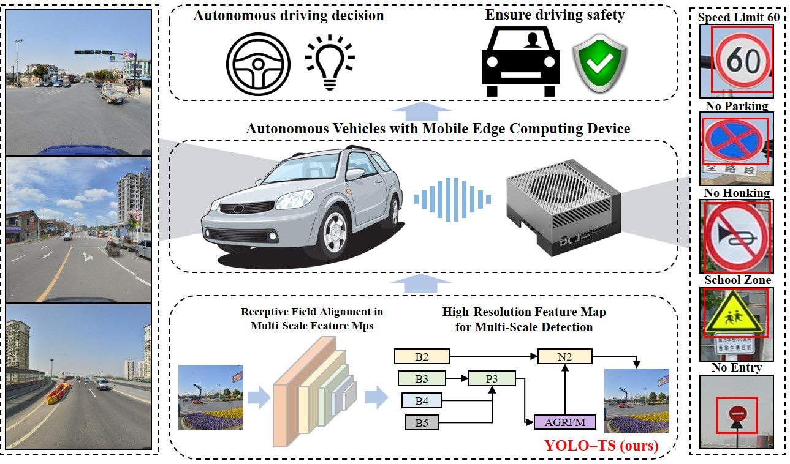
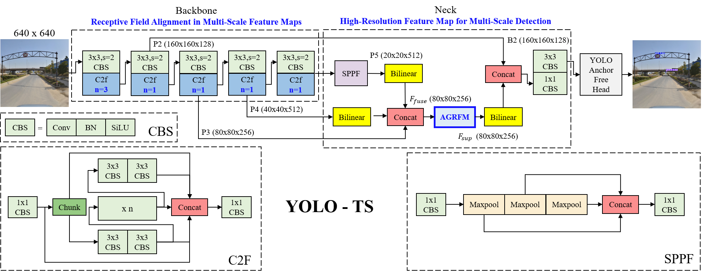

<p align="center">
  <h1 align="center">NanoVerse-TSR</h1>
  <p align="center"><strong>Contrastive Learning-Driven Traffic Sign Recognition</strong></p>
  <p align="center">
    <a href="https://ieeexplore.ieee.org/document/3704014">IEEE Sensors Journal 2026</a> ·
    Sun Yat-sen University
  </p>
</p>

<p align="center">
  <a href="#"></a>
  <a href="#"></a>
  <a href="#"></a>
  <a href="LICENSE"></a>
  <a href="#todo"></a>
</p>

<p align="center">
  
</p>

---

**NanoVerse-TSR** is a two-stage traffic sign recognition framework for autonomous driving and intelligent transportation.  
Stage 1 localizes small-scale signs with a **semantic-visual fusion detector** (RepVL-PAN + P2 head).  
Stage 2 performs fine-grained recognition via **cross-modal contrastive learning** (ViT + Rule-BERT on TSTIAD).

> **Paper:** Lu et al., *NanoVerse-TSR: Contrastive Learning-Driven Traffic Sign Recognition*, IEEE Sensors Journal, 2026.  
> **Authors:** Qiang Lu, Waikit Xiu, Xiying Li, Shenyu Hu, Shengbo Sun

---

## Highlights

| | |
|---|---|
| **Small-object detection** | RepVL-PAN semantic guidance + P2 head + SPD-Conv for multi-scale signs |
| **Long-tail recognition** | Rule-BERT + ViT contrastive classifier trained on **24,715** TSTIAD image-text pairs |
| **Real-time inference** | Semantic vector cache boosts throughput to **71.9 FPS** (RTX 3090, ablation) |
| **Robust sensing** | Strong performance on TT100K, CCTSDB2021, and adverse-weather subsets |

---

## Results

### TT100K detection (Table II)

| Method | Prec. | Recall | mAP50 | mAP50-95 |
|:--|--:|--:|--:|--:|
| YOLOv8s | 70.6 | 57.8 | 64.4 | 51.9 |
| YOLO11s | 74.2 | 55.6 | 65.3 | 52.3 |
| YOLO12s | 64.0 | 61.1 | 65.1 | 52.1 |
| YOLO-TS | 68.8 | 61.5 | 66.4 | 55.9 |
| **NanoVerse-TSR (Ours)** | **91.8** | **88.9** | **78.4** | **71.9** |

### Classifier on ground-truth crops (Table IV)

| Dataset | Top-1 Acc. |
|:--|--:|
| TT100K | **91.6%** |
| GTSRB | **97.3%** |

Full logs: [`data/experiments/NanoVerse-TSR/`](data/experiments/NanoVerse-TSR/)

---

## Downloads

Code and TSTIAD caption JSON are in this repo. **Our packaged datasets and paper checkpoints are coming soon.**

| What | Status | Link / notes |
|------|--------|--------------|
| Paper detector weights | **Coming soon** | will land under `data/weights/detector/` |
| Paper classifier weights | **Coming soon** | will land under `data/weights/classifier/` |
| TSTIAD crop images | **Coming soon** | captions are already in `data/datasets/*.json` |
| Prepared TT100K / CCTSDB layouts | **Coming soon** | official sources are available now (below) |
| TT100K (official) | Available | [Tsinghua-Tencent 100K](http://cg.cs.tsinghua.edu.cn/traffic-sign/) |
| CCTSDB2021 (official) | Available | [csust7zhangyu/CCTSDB2021](https://github.com/csust7zhangyu/CCTSDB2021) |
| GTSRB (optional) | Available | [INI GTSRB](https://benchmark.ini.rub.de/gtsrb_news.html) |
| CLIP ViT-B/16 init | Available | [OpenAI CLIP](https://openaipublic.azureedge.net/clip/models/5806e77cd80f8b59890b7e101eabd078d9fb84e6937f9e85e4ecb61988df416f/ViT-B-16.pt) → `classifier/model_data/ViT-B-16-OpenAI.pth` |
| YOLO11s backbone | Available | [ultralytics/assets](https://github.com/ultralytics/assets/releases/download/v8.3.0/yolo11s.pt) |
| bert-base-chinese | Available | [Hugging Face](https://huggingface.co/bert-base-chinese) (auto-download) |

```bash
# third-party init weights only
bash scripts/download_init_weights.sh
```

Folder layouts: **[docs/DATASETS.md](docs/DATASETS.md)** · **[docs/WEIGHTS.md](docs/WEIGHTS.md)**

---

## TODO

Release checklist. Tick these as assets go public.

- [x] Open-source training / inference code (this repo)
- [x] TSTIAD caption JSON + category text
- [ ] Host paper detector checkpoints (CCTSDB RepVL-PAN + P2, P2 baseline, end-to-end YOLO)
- [ ] Host paper classifier checkpoint (`enhance_token_91.6_best.pth`)
- [ ] Host TSTIAD crop images
- [ ] Host prepared TT100K / CCTSDB directory packs (or a one-click layout script)
- [ ] Replace **Coming soon** links in this README after the first Release
- [ ] Add a short inference demo video / extra qualitative figures

Watch [Releases](https://github.com/linusai0824-star/NanoVerse-TSR/releases) for updates.

---

## Quick Start

### 1. Clone & install

```bash
git clone https://github.com/linusai0824-star/NanoVerse-TSR.git
cd NanoVerse-TSR

python -m venv .venv && source .venv/bin/activate
pip install -r requirements.txt
python scripts/verify_install.py --skip-weights --skip-data
```

### 2. Fetch data & weights

Our packaged data and paper weights are **coming soon**. Third-party datasets / init weights can be fetched now (see **Downloads**). After our Release is up, place files as:

```
data/
├── datasets/
│   ├── TT100K_detection_221cls/
│   ├── TSTIAD_images/
│   └── CCTSDB/
└── weights/
    ├── detector/cctsdb_yolo11s_world8_best.pt
    └── classifier/enhance_token_91.6_best.pth
```

```bash
python scripts/verify_install.py
```

### 3. Run inference

```bash
python pipeline/infer.py \
  data/datasets/TT100K_detection_221cls/images/test/10056.jpg
```

Example output:

```
10056.jpg: 3 detections
  pne @ [416, 876, 431, 909]
  i5  @ [1273, 927, 1293, 948]
  pne @ [1215, 929, 1236, 950]
```

---

## Usage

<details>
<summary><b>Train detector (CCTSDB)</b></summary>

```bash
python detector/scripts/run.py train \
  --data detector/configs/cctsdb.yaml \
  --model detector/models/yolo11s-world.yaml \
  --epochs 200 --batch 64 --device 0
```
</details>

<details>
<summary><b>Validate detector</b></summary>

```bash
python detector/scripts/run.py val \
  --weights data/weights/detector/cctsdb_yolo11s_world8_best.pt \
  --data detector/configs/cctsdb.yaml
```
</details>

<details>
<summary><b>Weather-subset evaluation (Table VI)</b></summary>

```bash
python detector/scripts/run.py weather \
  --weights data/weights/detector/cctsdb_yolo11s_world8_best.pt
```
</details>

<details>
<summary><b>Train classifier (TSTIAD)</b></summary>

```bash
cd classifier && python train.py
```
</details>

---

## Project Structure

```
NanoVerse-TSR/
├── assets/                 # Figures for README & paper
├── classifier/             # Stage 2: ViT + Rule-BERT contrastive classifier
├── detector/               # Stage 1: RepVL-PAN + P2 detector
│   ├── configs/            # Dataset YAML (TT100K, CCTSDB)
│   ├── models/             # yolo11s-world, yolo11s-p2
│   └── scripts/            # train · val · weather eval
├── pipeline/infer.py       # End-to-end detect → classify
├── data/                   # Datasets, weights, experiment logs
├── docs/                   # Dataset & checkpoint guides
├── nanoverse/              # Shared path utilities
└── scripts/verify_install.py
```

<p align="center">
  
</p>

---

## Citation

If you find this work useful, please cite:

```bibtex
@article{lu2026nanoverse,
  title   = {NanoVerse-TSR: Contrastive Learning-Driven Traffic Sign Recognition},
  author  = {Lu, Qiang and Xiu, Waikit and Li, Xiying and Hu, Shenyu and Sun, Shengbo},
  journal = {IEEE Sensors Journal},
  year    = {2026},
  doi     = {10.1109/JSEN.2026.3704014}
}
```

---

## Acknowledgements

- [Ultralytics YOLO11](https://github.com/ultralytics/ultralytics) for the detection backbone  
- [TT100K](http://cg.cs.tsinghua.edu.cn/traffic-sign/) and [CCTSDB2021](https://github.com/csust7zhangyu/CCTSDB2021) datasets  
- [YOLO-TS](https://arxiv.org/abs/2410.17144) is cited as an **external baseline only** — not included in this repo

---

## License

This project is released under the [MIT License](LICENSE).
